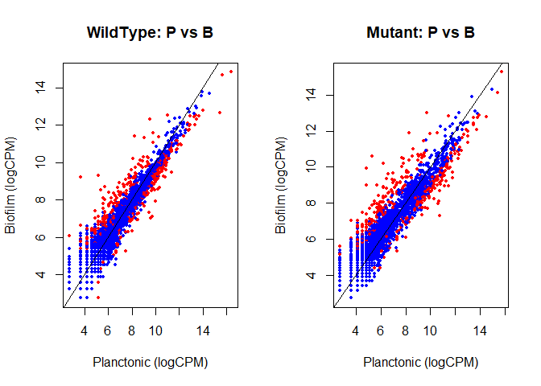
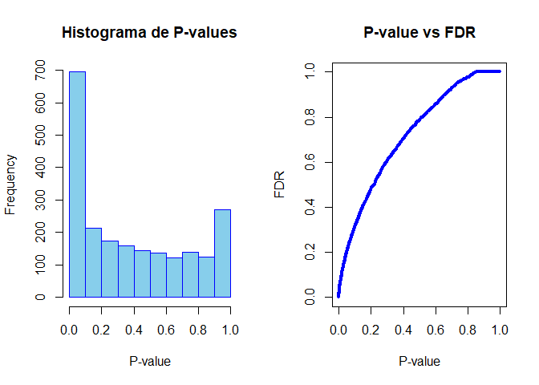

Análisis de Expresión Diferencial de RNA-seq en S. acidocaldarius
================
\[Javier Torres\]
1/1/2026

``` r
# Configuración global
  knitr::opts_chunk$set(echo = TRUE, warning = FALSE, message = FALSE, fig.path = "figure/")


library(edgeR)
```

    ## Loading required package: limma

``` r
# --- RUTA DE DATOS (Confirmada) ---
input_dir <- "C:/Users/torre/Downloads/~" 

# Carpeta de salida para tablas
output_dir <- "../diff_expr"
if(!file.exists(output_dir)) dir.create(output_dir, recursive=TRUE)

# Cargar archivos
wild_p <- read.delim(file.path(input_dir, "MW001_P.count"), header=F, row.names=1)
wild_b <- read.delim(file.path(input_dir, "MW001_B3.count"), header=F, row.names=1)
mut_p  <- read.delim(file.path(input_dir, "0446_P.count"), header=F, row.names=1)
mut_b  <- read.delim(file.path(input_dir, "0446_B3.count"), header=F, row.names=1)

# Crear matriz y limpiar
rawcounts <- cbind(wild_p, wild_b, mut_p, mut_b)
colnames(rawcounts) <- c("WildType_P", "WildType_B", "Mutant_P", "Mutant_B")
rawcounts <- rawcounts[!grepl("^__", rownames(rawcounts)), ]

# Filtrar baja expresión
keep <- rowSums(cpm(rawcounts) > 1) >= 3
rawcounts <- rawcounts[keep,]
# Diseño experimental: P=Planctónico, B=Biofilm
group <- factor(c("P","B","P","B")) 
y <- DGEList(counts=rawcounts, group=group)
y <- calcNormFactors(y)
y <- estimateCommonDisp(y)
y <- estimateTagwiseDisp(y)

# Test Exacto (Comparación Planctónico vs Biofilm)
et <- exactTest(y, pair=c("P","B"))
top_tags <- topTags(et, n=Inf)$table

# Guardar tabla
write.csv(top_tags, file.path(output_dir, "resultados_edgeR.csv"))
# Identificar genes significativos (FDR < 0.1)
is_de <- top_tags$FDR < 0.1
de_ids <- rownames(top_tags)[is_de]

# Obtener conteos normalizados (logCPM) para graficar
counts_norm <- cpm(y, log=TRUE)

# 1. Gráfico de dispersión (Scatter Plot)
# Coloreamos de rojo los genes diferencialmente expresados
par(mfrow=c(1,2))
plot(counts_norm[,"WildType_P"], counts_norm[,"WildType_B"], 
     col=ifelse(rownames(counts_norm) %in% de_ids, "red", "blue"),
     main="WildType: P vs B", xlab="Planctonic (logCPM)", ylab="Biofilm (logCPM)", pch=16, cex=0.5)
abline(0,1, col="black")

plot(counts_norm[,"Mutant_P"], counts_norm[,"Mutant_B"], 
     col=ifelse(rownames(counts_norm) %in% de_ids, "red", "blue"),
     main="Mutant: P vs B", xlab="Planctonic (logCPM)", ylab="Biofilm (logCPM)", pch=16, cex=0.5)
abline(0,1, col="black")
```

<!-- -->

``` r
# 2. Histogramas de P-values y FDR
par(mfrow=c(1,2))
hist(top_tags$PValue, col="skyblue", border="blue", main="Histograma de P-values", xlab="P-value")
plot(top_tags$PValue, top_tags$FDR, col="blue", main="P-value vs FDR", xlab="P-value", ylab="FDR", pch=16, cex=0.5)
```

<!-- -->
